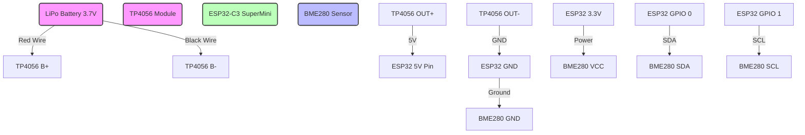

# 🌡️ ESP32-C3 Matter & Thread Sleepy Sensor

  

A high-efficiency, battery-powered environmental sensor (Temperature, Humidity, Pressure) that runs on the Matter protocol over Thread. 

Designed for the **ESP32-C3 SuperMini**, this device utilizes Deep Sleep and adaptive reporting to maximize battery life. It features a custom 3D-printed enclosure and a rechargeable 1000mAh LiPo battery via a USB-C TP4056 module.

## ✨ Features
* **Matter over Wi-Fi/Thread Support:** Natively integrates with Apple Home, Google Home, Alexa, and Home Assistant.
* **Deep Sleep Logic:** The device sleeps 99% of the time, checking sensors every 15 minutes.
* **Adaptive Reporting:** Only connects to radio if:
    * Temperature changes by > 0.8°C
    * Humidity changes by > 3%
    * Pressure changes by > 2hPa
    * Or 24 hours have passed (Heartbeat)
* **Rechargeable:** Integrated TP4056 charging circuit with USB-C.

## 🛠️ Hardware Required
* **Microcontroller:** ESP32-C3 SuperMini.
* **Sensor:** GY-BME280 (I2C).
* **Power:** * MakerHawk 3.7V 1000mAh LiPo Battery.
  * TP4056 USB-C Charging Module (with protection).
* **Case:** Custom 3D Printed Enclosure (STLs in `/3d_files`).

## 🔌 Wiring Guide

## 💻 Installation & Flashing

### 1. Arduino IDE Setup
1.  Install ESP32 Board Manager (v2.0.11+).
2.  Install the **"Matter"** library (Espressif).
3.  Install **Adafruit BME280** library.

### 2. Critical Settings
You **must** change the partition scheme or the upload will fail.
* **Board:** ESP32C3 Dev Module
* **USB CDC On Boot:** Enabled
* **Partition Scheme:** `Huge App (3MB No OTA/1MB SPIFFS)`

### 3. Flash
Connect the ESP32 directly via its USB port (or the TP4056 if data lines are connected, though direct ESP32 connection is recommended for flashing) and upload `src/MatterSensor.ino`.

## 🚦 Usage & Factory Reset
* **Pairing:** On first boot, the LED turns **Solid Blue**. You have 5 minutes to pair using the Matter QR code printed in the Serial Monitor.
* **Factory Reset:** If you change networks, unplug the device, plug it back in, and hold the **Boot Button** for 3 seconds while the LED is **Green** (first 10 seconds of boot).

## 📂 3D Printing
STLs are located in the `3d_files` directory. 
* **Material:** PLA or PETG
* **Infill:** 15%

## 📜 License
MIT License.